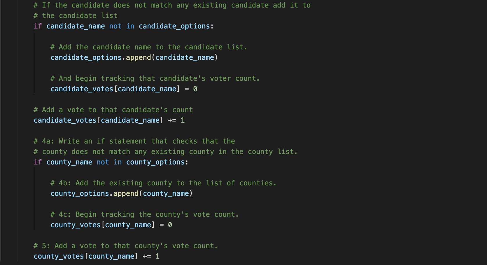

# Election_Analysis

## Project Overview 
Assisting a Colorado Board of election employee to complete the election audit for a Congressional precinct election 

1. Calculate the total number of votes cast
2. Get a list of candidates participating in the election
3. Calculate the total votes for each candidate 
4. Calculate the total perecentage of votes for each candidate 
5. Identify the winner of the election by popular vote 

## Resources 
-Data source: election_results.csv
-Software: Python 3.7.6, Visual Studio Code 1.58.0 
 
 ## Election Audit Results 
  The analysis of the election show that: 
  
 - A total of 369,711 votes were cast in this election. 
 - The participating counties were: Jefferson, Denver and Araphoe 
 - The County results were:
     -  Jefferson: 10.5% (38,855)
     -  Denver: 82.8% (306,055)
     - Arapahoe: 6.7% (24,801)
 Denver had the largest number of votes 
 
- The candidates were: 
  - Charles Casper Stockham
  - Diana DeGette
  - Raymon Anthony Doane
 The candidate results were:
  - Charles Casper Stockham received 23.0% of the votes with 85,213 votes 
  - Diana DeGette received 73.8% of the votes with 272,892 votes
  - Raymon Anthony Doane received 3.1% of the votes with 11,606 votes
 
 The winner of the election was: 
  Diane DeGette who received 73.8% of the votes with a total of 85,213 votes 
  
## Election Audit Summary 
In order to facilitate other election audits, the for loop that is used to retrieve candidate names, county names, and record total votes can be reused by simply changing the file that holds the election data, and editing index numbers accordingly.
  -This image is from "PyPoll_Challenge.py"
.

Likewise, the conditional statements used to add the candidate and county names, as well as county votes can also be reused for another election audit with similar data. Additioanlly, if a dataset includes another variable such as gender, this code can be refactored by creating an empty list for gender, looping through the rows, and tracking the count of the different genders that participated. 
    -This image is from "PyPoll_Challenge.py"
.

